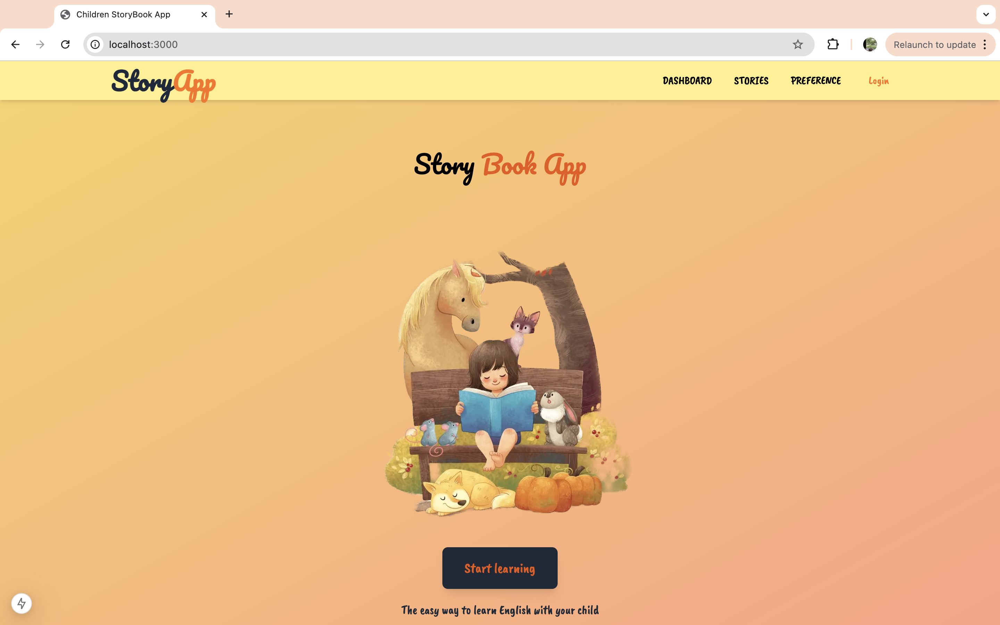

# AI Children's Story App  

An interactive and AI-powered application designed to create delightful, age-appropriate stories for children. The app provides a user-friendly interface and leverages cutting-edge AI technology to generate personalized stories based on user preferences. Built with **Next.js 14**, **TypeScript**, and **Tailwind CSS**, this project emphasizes responsive design and seamless storytelling.  

**Home Page**



---  

## 🚀 Features  

### 1. **User Authentication**  
- Secure registration and login system.  
- Users can easily create accounts and manage their sessions.  

### 2. **Responsive Navigation**  
- A clean and dynamic navbar that adapts to various screen sizes.  
- Provides quick access to:  
  - **Home**: Explore the app.  
  - **Dashboard**: Set preferences and generate stories.  
  - **Preferences**: Customize story settings.  
  - **User Stories**: View previously generated stories.  
  - **Login/Logout**: Manage user sessions.  

### 3. **Personalized Dashboard**  
- Tailored to user preferences, featuring:  
  - **Age Group Selection**: Choose between "Toddler" and "Kid" categories.  
  - **Theme Selection**: Customize the story theme.  
  - **Story Generator Button**: Easily initiate AI-powered story creation.  

### 4. **Preference Customization**  
- **Toddler Group**: Displays an engaging gallery of images to assist in selecting themes.  
- **Kid Group**: Offers a detailed form to provide descriptive inputs for story personalization.  

### 5. **AI-Generated Stories**  
- Automatically generates a captivating story based on user preferences, including:  
  - **Story Title**: AI-curated title to match the selected theme.  
  - **Story Image**: AI-generated artwork to complement the story.  
  - **Short Story**: A narrative tailored to the chosen age group and theme.  
- Progress feedback provided via a **Toastify Loader** during story generation.  

### 6. **Modern Tech Stack**  
- **Frontend**: Next.js 14, TypeScript, Tailwind CSS, Axios for HTTP requests.
- **Backend**: C#, Python and PostgreSql

### 7. **📷 Media Link**
- **Youtube Video link**:
  
  **Part 1** https://www.youtube.com/watch?v=Usgh5Dy4Jp
  **Part 2** https://www.youtube.com/watch?v=oNG30n75hwY
  
- **Screenshots Link**
  https://github.com/zainabimran94/StoryBook-Frontend/blob/36750479782cece536be897590d0c7a332a2947a/WebsiteShowcase.md
  
## 🌐 Backend Services  
The backend architecture integrates C# and Python services to ensure seamless communication and efficient processing of user requests:  
- **C# API**:  
  - Manages user authentication, preferences, and interactions with the PostgreSQL database.  
  - Acts as the intermediary between the frontend and the Python AI service.  
  - Receives user preferences from the frontend and forwards them to the Python AI service via **HTTP client**.  
  - Handles the response from Python, including AI-generated titles, images, and stories, and sends the final data back to the frontend.  
  - GitHub Repository: [StoryBook C# Backend](https://github.com/zainabimran94/StoryBook-c-.git)  

- **Python AI Service**:  
  - Processes data received from the C# API to generate personalized story content.  
  - **Gemini API**: Utilized for creating engaging story titles and narratives.  
  - **Flux.dev AI**: Generates custom story images based on user preferences.  
  - Sends the generated data (titles, stories, and images) back to the C# API via **HTTP client**.  
  - GitHub Repository: [StoryBook Python Backend](https://github.com/zainabimran94/StoryBook-Python.git)  

- **Database**:  
  - **PostgreSQL**: Used to store user data, preferences, and records of generated stories.  

This backend architecture ensures smooth communication between the frontend and the AI services, providing users with a responsive and engaging experience.  


---  

## 📦 Pre-installed Dependencies  

- **Next.js 14**:  
  - Optimized with Turbopack for faster builds.  
  - Built-in TypeScript and ESLint support.  

- **Tailwind CSS**:  
  - A utility-first CSS framework for streamlined UI development.  

---  

## 📂 Additional Dependencies  

To enhance functionality and usability, the following packages were added:  

### **UI and Styling**  
- `@material-tailwind/react`: Pre-built Tailwind components.  
- `@nextui-org/button` & `@nextui-org/dropdown`: For clean, accessible UI elements.  
- `react-icons`: Icon library for enriched visual elements.  
- `clsx`: Manages conditional class merging.  
- `tailwind-merge`: Dynamically combines Tailwind classes.  

### **Animations and State Management**  
- `framer-motion` & `motion`: Smooth animations and transitions.  
- `react-use`: Provides essential React hooks for state management.  

### **Utilities**  
- `axios`: For seamless HTTP requests.  
- `jwt-decode`: Decodes JSON web tokens for authentication.  
- `react-toastify`: Displays notifications with a modern, polished design.  

### **Hamburger Menu**  
- `hamburger-react`: A compact and responsive menu toggle.  

---  

## 💻 Installation  

Follow these steps to set up the project locally:  

1. **Clone the Repository**:  
   ```bash  
   git clone https://github.com/zainabimran94/StoryBook-Frontend.git
2. **Install Dependencies**:
   npm install
3. **Start the Development Server**:
   npm run dev
   
## 📝 Contributing
We welcome contributions to improve the app! Feel free to submit issues, feature requests, or pull requests via GitHub.

## 📄 License
This project is licensed under the MIT License. See the LICENSE file for details.
